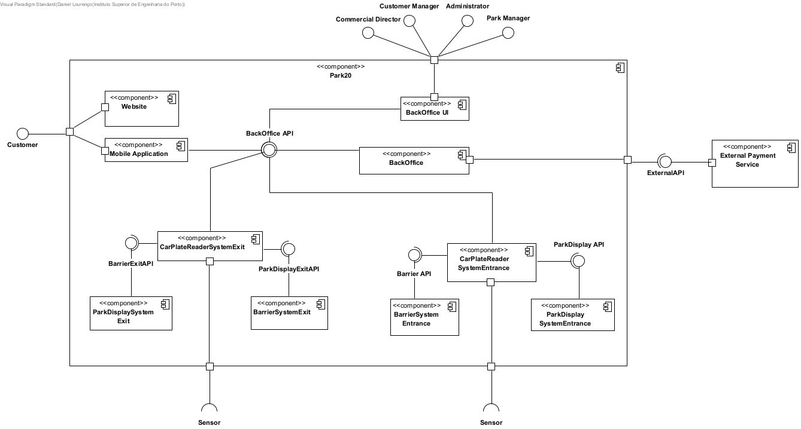
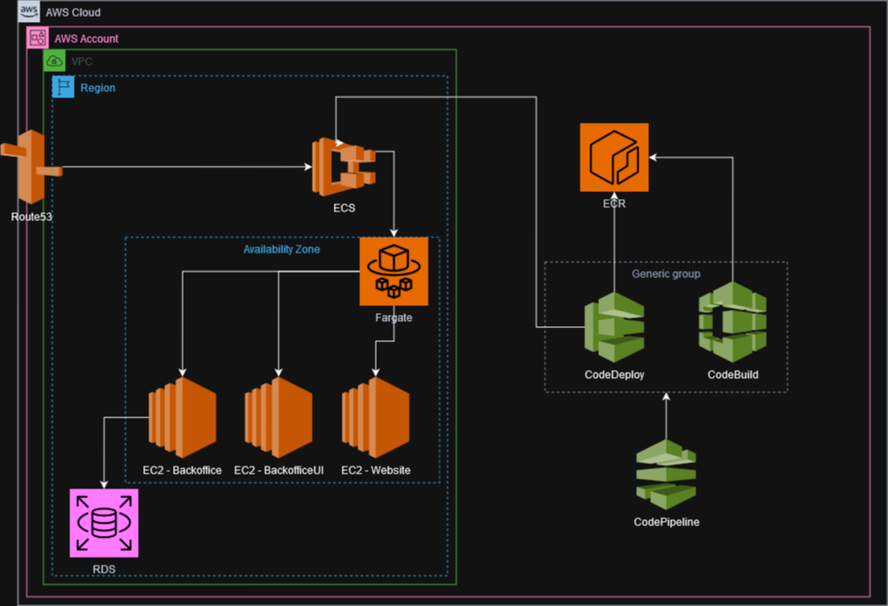
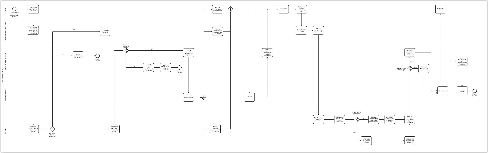
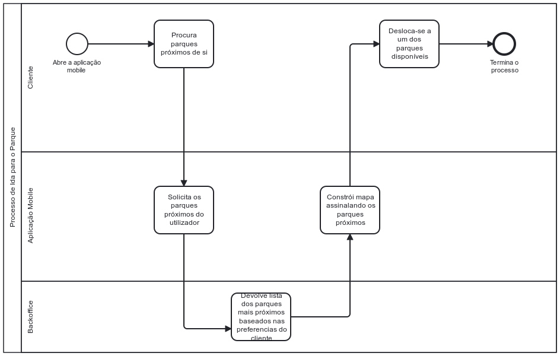
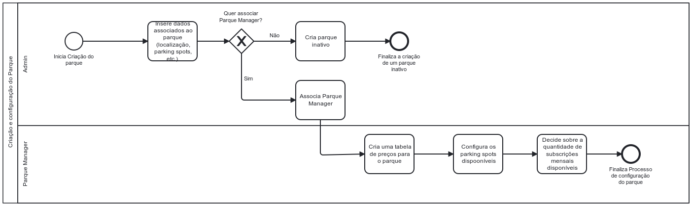
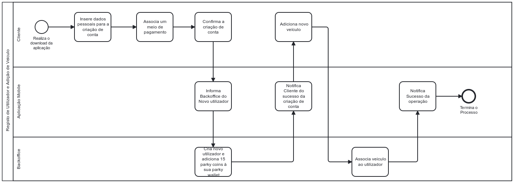
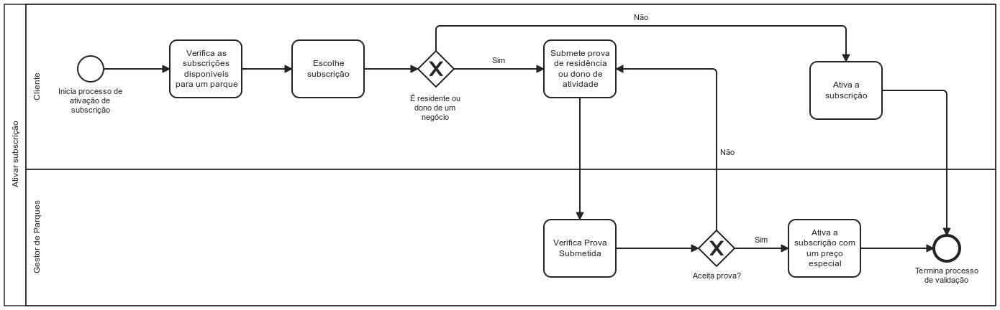

## Working methodology ##

In our team, we have adopted an agile working methodology to achieve  the needs of our project. Our approach leverages the Scrum framework, supported by Bitbucket for version control and Jira for the management of epics and user stories.

Within Scrum, the defined roles of Scrum Master, Product Owner, and Development Team ensure well-defined responsibilities. We utilize Jira to create and track epics and user stories, ensuring that everyone has a clear view of objectives and tasks.

The choice of Scrum, Bitbucket, and Jira is highly suitable for our development environment. Scrum enables us to effectively manage changing requirements through iterative deliveries and close collaboration with our clients. Bitbucket provides a robust solution for version control, ensuring efficient code management. Jira is a versatile tool for task definition, tracking, and management, perfectly aligning with our project's needs.

We employ short-duration sprints within Scrum, allowing us to reassess priorities at the end of each iteration. If new information or client requirements emerge, we can easily add or adjust user stories, preserving the flexibility of our process.

Continuous evaluation is an integral component of our methodology. After each sprint, we conduct retrospectives to identify areas for improvement. Based on these assessments, we improve our process to continually enhance efficiency and the quality of our work. 

## Definition of Ready and Done ##

* **Ready** - The user story needs to be clear (all team members must understand what it means), testable (there is an effective way to determine if the functionality works as expected) and feasible (can be completed in one sprint, according to the Definition of Done). At this point the user story is ready to enter the sprint.
* **Done** - The user story meets all requirements and acceptance criteria. The code is integrated into the main codebase, reviewed and tested. The documentation and user guides are updated accordingly. The product owner or stakeholder has approved the work.

## Roles ##

* **Product Owner** - Marta Barbosa
* **Scrum Master** - Alfredo Garcês
* **Developer** - Daniel Lourenço
* **Developer** - Luís Henrique Silva
* **Developer** - Luís Miguel Silva

#### Product Owner (PO) ####
"*Is the representative of the stakeholders and customers who use the software. They focus on the business part and is responsible for the ROI of the project. They Translate the vision of the project to the team, validate the benefits in stories to be incorporated into the Product Backlog and prioritize them on a regular basis.*" (https://www.nimblework.com/agile/scrum-methodology/)

#### Scrum Master ####
"*The person who leads the team guiding them to comply with the rules and processes of the methodology. Scrum master manages the reduction of impediments of the project and works with the Product Owner to maximize the ROI. The Scrum Master is in charge of keeping Scrum up to date, providing coaching, mentoring and training to the teams in case it needs it.*"
(https://www.nimblework.com/agile/scrum-methodology/)

## Related Work ##

### Flash Parking ###

FlashParking is a revolutionary parking app that redefines the traditional hassle of finding and paying for parking spaces. With cutting-edge technology, it transforms the smartphone into a powerful tool for effortlessly locating available parking spots nearby, beyond that, it's a personal parking assistant that not only simplifies the search for parking but also enables seamless payments through the app, eliminating the need for fumbling with change or deciphering confusing meters.

FlashParking simplifies the parking experience with key features:

1. **Parking Management Systems:** Parking management systems for access and revenue control, valet, and events that rely on software programs configured for each location, right down to individual lane functionality. Once the physical hardware is installed, the team seamlessly pushes the parking management software functionality directly to the parking space location over his cloud-based operating system, FlashOS.

2. **Hardware:** As the majority of functionality is embedded in the cloud-based software, a minimalist approach was taken in designing the hardware. A small number of easily controlled kiosks, reliable gates, and optional cash machines constitute a customizable solution that demands minimal maintenance while offering maximum versatility.

3. **Parking Enforcement Solutions:** To secure absolute control over the parking location, the suite of parking enforcement software and hardware options is provided. Thanks to cloud-born technology, it allows for enhanced parking compliance, makes data-driven decisions, and boost revenue—all while monitoring the entire operation in real-time.
[Flash Parkin](https://www.flashparking.com/products/parking-systems/)

### ParkJockey ###

This app leverages advanced technology to streamline the process of finding and securing parking spaces. Users can enjoy a seamless journey as they effortlessly locate available parking spots.

What sets ParkJockey apart is its commitment to convenience. The app not only simplifies the search for parking but also offers a user-friendly platform for hassle-free payments. Say goodbye to the challenges of dealing with change or confusing payment systems—ParkJockey provides a smooth and efficient payment experience directly through the app.

ParkJockey is a time-saving and cost-effective tool, providing real-time insights into parking availability and pricing. Users can make informed decisions, optimizing their parking strategy and avoiding unnecessary delays or expenses. Whether navigating a bustling urban landscape, attending events, or simply running errands, ParkJockey emerges as a professional-grade solution, enhancing the efficiency and ease of the parking process. It's not just an app; it's a sophisticated approach to modern parking convenience.

1. Mobile Attendant
    * Accept all forms of payments & reservations for comprehensive revenue management (EMV Chip, ApplePay. Cash/Card)z\
    * Transactions processed in 3-5 seconds
    * Intuitive interface with real-time feedback on capacities and vehicle count
2. Reservations
    * Ensure customers park efficiently to minimize impact on traffic flow
    * Improved customer experience
    * Support planning with better understanding of car park demand
    * Obtain visibility of data and gain insights on your customers
3. CommandCentre
    * Management of parking operations
    * Manage parking rates and capacity in real time
    * Leverage actionable insights about your parking operation
    * 24/7 dedicated customer support
4. AutoVigil LPR
    * Allow vehicles to enter without needing to stop for attendant
    * Season pass holders can simply enter the lots. No need for hangtags or passes
    * Auto-alert enforcement in case of non-payment or overstays
    * AutoPay solution allows registered vehicles to seamlessly drive in and out, and account automatically charged
5. GetHere
    * Provides most efficient method of transport to your venue
    * Gain insightful data on who is visiting your venue
    * Ability to book parking, taxi's and gain public transport information
    * Easily embedded onto site
6. TerminalPro
    * Ticketless parking using vehicle license plates
    * Accepts Credit Card, EMV Chip and Apple Pay
    * Allow fans to enter venue faster for a much better experience
    * Can be utilized for concessions and cross-selling additional services

[Park Jockey](https://www.parkjockey.com/en-us/)

### The Parker ###

TheParker is the app build for iOS using Swift 4.2 and an Android version.

It uses Firebase Realtime Database and Firebase Storage.

* Upload Your parking Spot
* Search Parking Space.
* Login Using Email.
* Check previous transactions.
* Add my Cars.
* Book Parking.
* Get direction to the parking spot.
* Call the spot owner.
* See previous parking Spot Added.
* Check previous Booking.
* Local Notification.

[The Parker](https://github.com/ketanchoyal/theParker-iOS/)

## Product Vision ##

Our mission is to revolutionize the parking experience through an innovative park operations management system that prioritizes seamless and customer-focused interactions. We are committed to creating a personalized system for each one of our registered customers, moving away from traditional ticketing methods towards a more simpler and loyalty-driven approach.

Our system ensures a smooth entry and exit process without the need for physical tickets. Users can park effortlessly, receive personalized welcome messages, and earn PARKY coins that can be used for future parking. These coins can be accumulated through activities such as registering for the app, using our parks, and referrals for new users, fostering loyalty and continuous engagement.

To cater to electric and GPL vehicle owners, our system provides real-time availability of dedicated parking spots through a user-friendly parking app. The app supports multiple languages (Portuguese, English, Spanish) and adheres to accessibility standards (WCAG), ensuring a inclusive experience for all users.

Security and compliance are also one of our top priorities. We implement industry-standard security measures, including two-factor authentication, to protect customer data and ensure secure and reliable transactions.

In summary, our product vision aims to build a customer-centric, technologically advanced, and secure park operations management system. Our goal is to improve satisfaction and convenience, ultimately reshaping the way people perceive and engage with parking facilities.

## User Personas ##

### Busy Commuter - Sarah ###

#### Background ####

Sarah is a 32-year-old marketing professional who commutes to the city for work every day. She juggles a busy schedule, attending meetings and running errands during the day.

#### Needs ####

Sarah needs a parking app that helps her find convenient parking spots quickly. Time is crucial for her, so the parking20 app providing real-time availability is very much appriciated.

### City Explorer - Alex ###

#### Background ####

Alex is a 25-year-old recent graduate who loves exploring the city on weekends. They enjoy visiting new restaurants, museums, and events.

#### Needs ####

Alex needs a parking app that helps find parking spaces. The app should offer a user-friendly interface, allowing Alex to discover parking options close to their planned activities.

### Business Man - Henry ###

#### Background ####

Henry is a 55-year-old entrepreneur who serves as the CEO of his own company. Due to the nature of his work, he engages in frequent travels, both nationally and internationally.
Henry maintains two cars to cater to his diverse requirements – a company car exclusively utilized for business-related trips and a personal car for his private affairs. Consequently, the necessity arises for him to find suitable parking solutions for both vehicles during their respective uses.

#### Needs ####

Henry is seeking a parking app that offers the convenience of managing multiple cars under a single account. He requires the application to furnish detailed information about available parking spaces tailored to his specific needs, ensuring seamless parking solutions for both his business and personal vehicles.

### Environmentally Conscious - Maya ####

#### Background ####

Maya is a 27-year-old environmental activist who prefers eco-friendly transportation options. She uses a combination of public transport, cycling, and occasionally her electric car.

#### Needs ####

Maya needs a parking app that highlights environmentally friendly parking options, such as spaces with electric vehicle stations. The app should align with her values and encourage sustainable travel.

<!-- ### Commercial Director ###

**Details:** The Commercial Director is a senior professional who leads the business strategy of Park20. They have extensive experience in the industry and have the authority to make strategic decisions.

**Needs and Objectives:** The Commercial Director is focused on business growth, expanding the park network, and maximizing profits. They need tools to monitor the performance of all parks, analyze usage data, and make informed decisions about Parky pricing and expansion.

**Representativity:** This persona plays a key role in company management and is a fundamental part of the target audience.

### Customer Manager ###

**Details:** The Customer Manager is responsible for maintaining managing customers accounts within Park20 system.

**Needs and Objectives:** The Customer Manager needs tools to handle customer doubts, manage payments, and resolve issues. They are focused on customer satisfaction and account management.

**Representativity:** This persona is an essential part of the park management team and represents users who interact directly with customers.

### Customer ###

**Details:** The Customer is the person who uses Park20 parks to park their vehicle. They can be a local resident or a visitor.

**Needs and Objectives:** The Customer seeks convenient, safe parking with fair prices. They want a hassle-free parking experience, including easy access, simple payment, and up-to-date information on parking availability.

**Representativity:** Customers are the main target audience of the Park20 system. They can be a resident or visitor.

### Admin ###

**Details:** The Admin is a Park20 system administrator with special privileges to configure and maintain the system.

**Needs and Objectives:** The Admin needs tools to configure parks, manage users and ensure the system is running smoothly.

**Representativity:** Admins are a crucial part of the Park20 system management team and represent a technical and management audience.

### Park Manager ###

**Details:** The Park Manager is responsible for a specific park in the Park20 network.

**Needs and Objectives:** The Park Manager needs tools to configure and manage their park, set prices, monitor occupancy, address local issues, and interact with their park's customers.

**Representativity:** Park Managers are a critical part of the Park20 system, ensuring the smooth operation of individual parks. This persona represents part of the staff that will work for the company. -->

## Non Functional Requirements ##

**Performance:**

* The system should support a minimum of 25,000 registered users.
* The system must handle an average of 1090 park movements per day without performance degradation.

**Security:**

* Two-factor authentication must be enforced for all registered users.

**Compatibility:**

* The mobile application should be compatible with the latest two major versions of both iOS and Android.
* The system should be use include a partnership with a payment handling entity (e.g., MBWay, Visa, ...)

**Usability:**

* The user interface must adhere to Web Content Accessibility Guidelines (WCAG) to ensure accessibility for all users.

**Internationalization:**

* The solution should support language localization in Portuguese, English, and Spanish.

**Regulatory Compliance:**

* The system must comply with data protection laws and regulations in Portugal and other relevant jurisdictions.
* The solution should adhere to local and international parking regulations.

## High-level scope of Sprint ##

For Sprint 1, we have prioritized certain functionalities to deliver a simplified version of the product, focusing on meeting our customer's basic needs.
The selected epics for this sprint were:

* Add a park;
* Customer registration;
* Payment method management;
* Add a vehicle;
* List nearby parks and availability;
* Simulate park gate opening;
* Display to show welcome, goodbye and park availability messages;
* Simulate park gate closing;

For the application to function, these features don't need to be 100% complete,so we've aimed for the essential and fundamental aspects. Concerning the parks, they will be manually added to the database. Customer and vehicle registrations won't have validations, such as verifying ID card numbers or car registration validity. Only one payment method will be available. The listing of nearby parks will be done through enumeration without the aid of a map. We will simulate park gate operations and the messages displayed will include information about park availability, entrances and exits.

## Architecture and Technologies ##

* **Website** - Features a promotional landing page displaying commercial information and provides links for downloading the app.

* **Mobile Application** - Designed for park users facilitates tasks such as registering customers and their vehicles, managing personal information, payment methods, adding or changing vehicles, checking activity logs, monitoring outstanding payments, displaying nearby park maps indicating available parking spots, handling monthly subscriptions, offering parking suggestions based on current traffic and user habits, checking PARKY wallet, inviting other users, viewing notifications, and enabling account cancellation.

* **CarPlateReader System** - Software simulation that focuses on reading license plates accurately and returning the plate data to the central system. It should include a RESTful API for communication and a frontend component for the actual plate reading.

* **Barrier System** - Software simulation that involves creating a separate system to manage parking barriers effectively. It should simulate the time it takes for the barrier to open and close, provide a frontend interface for manual control, and offer an API for interaction with other parts of the system.

* **Park Display System** - This component provides real-time information to users by displaying the current status of the parking facility at the entrance. It should offer an API for updating the displayed text to convey information about availability or full capacity.

* **BackOffice** - Component that involves the Park management, Customer management and Parky Wallet management. Managing the park involves setting up its configurations such as locations, floors, and various types of parking spots, appointing managers, controlling price tables, enabling or disabling parking spots temporarily, monitoring real-time occupancy, and generating reports on parking usage. Additionally, handling customer affairs includes identifying those with pending payments, the ability to block customers on a temporary or permanent basis, categorizing customers based on their park usage and outstanding payment status, sending individual or bulk messages to customers (e.g., for updates on price table changes), and managing the PARKY wallet by defining thresholds, providing reports and analytics, and distributing PARKY coins in bulk to users.

* **BackOffice UI** - Interface that is made available for all the sub-components that represent the BackOffice component.

* **External Payment Service** - Software for simulating a partnership with SIBS/Mbway.

* **Sensor** -  component responsible for checking the proximity of vehicles.

### Technologies that will be used ###

* **Frontend** - Angular
* **Backend** - C#
* **Cloud Provider** - AWS
* **Database** - SQL Server

## Assumptions & Dependencies ##

In the context of the Park20 project, the "Assumptions & Dependencies" section should address specific assumptions and dependencies critical to the success of the parking management system implementation. Here are some typical assumptions and dependencies to consider:

**Assumptions:**

Technology Availability: It is assumed that necessary technologies, such as license plate readers and online payment systems, are available and functioning as planned.

Customer Adoption: It is assumed that customers will embrace the new system and sign up to use it.

Adherence to Standards and Regulations: It is assumed that the system will comply with local and national standards and regulations related to parking and data privacy.

**Dependencies:**

Integration with Third-Parties: We depend on successful integration with external service providers, such as payment processors.

Availability of Hardware and Software: We depend on the availability and functionality of hardware, such as license plate readers.

Coordination with Park Managers: We depend on effective collaboration with park managers to set up and manage parks.

Users: We depend on user to use the system otherwise the company will go brankrupt.

Regulatory Approval: We depend on regulatory approval and compliance, which may impact the development and operation of the system.

Availability of Financial Resources: We depend on financial resources to fund the development and ongoing operation of the system.

## Operating costs estimation ##

#### Monthly AWS costs ####

**Region** - Spain[1]

**ECS + Fargate**[2] - Elastic container service - Compute instances - 15,59€ - 3 containers

* Free for 6 months with AWS free tier
* Total: 46,76€

**ECR** - Elastic container registry - 20GB

* Total: 1,86€

**VPC** - Network

* Total: Free

**Route53** - Network

* Total: 0,47€

**RDS** - Database SQL Server - 8vcpu/32GB - 500GB - 1 instance

* Free for 1 year with AWS free tier if 750hr of monthly usage on a single-AZ with 20GB
* Total: 4755,15€

**Code Pipeline V1** - CICD - 2 instances

* 1 Free pipeline forever
* Total: 1,86€

**Code Deploy** - CICD

* Total: Free

**Code Build** - CICD - 500 builds - 10 minutes per

* 100 build minutes free per month
* Total: 18,63€

**All Services Total:**

4824,73€/Month

**Note:** if environments such as dev, int and prod are required the cost is 4825€ * number of environments. 

**6 Month Cost:**

28 948,38€/Month

### AWS Diagram ###

[1] - https://calculator.aws/#/
[2] - https://www.youtube.com/watch?v=DVrGXjjkpig

## Project Estimation ##

Since the MVP (minimum valueble product) will take around 2 months to be completed. The full project should be able to built in 9 to 12 months estimation given that no more functionalities are added. Estimation may vary if new process are requested.

## General Workflows ##

* **Park Entrance and exit diagram**

* **Pre parking diagram**

* **Create and configure park**

* **Register User and Add Vehicle**

* **Activate Subscription**

